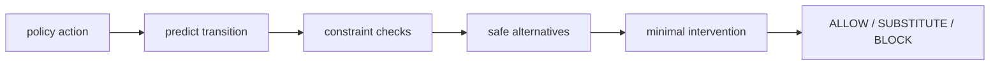

# Architecture

## Components

### Policy boundary
The gate accepts an action proposed by any upstream policy.

### Predictive step
A simple transition function estimates the next state.

### Constraint layer
Named predicates identify predicted safety violations.

### Intervention selector
If needed, selects the closest safe alternative; otherwise blocks execution.

## Design principle

Keep the learned policy separate from the runtime authority that decides whether a proposed action may execute.
